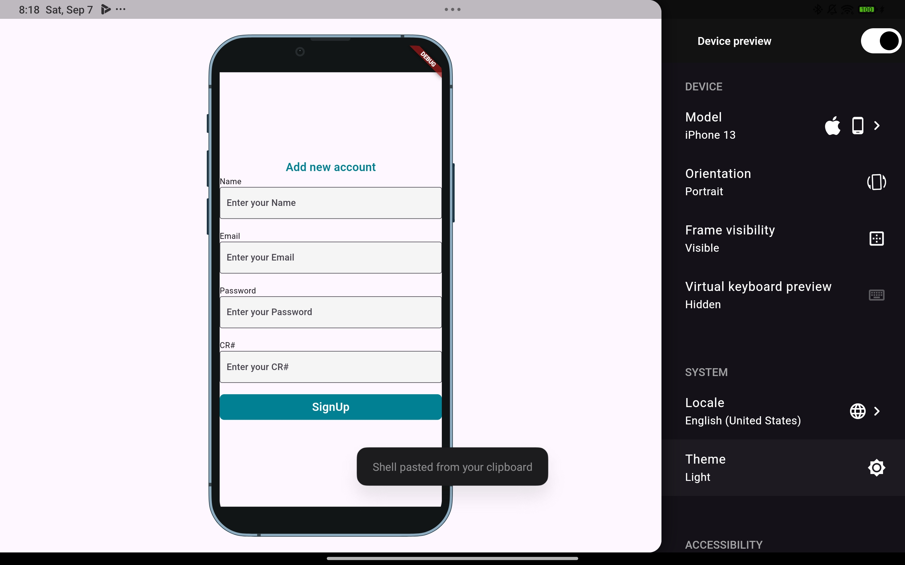
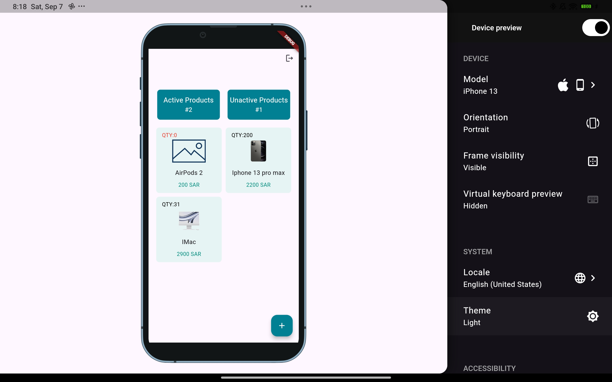
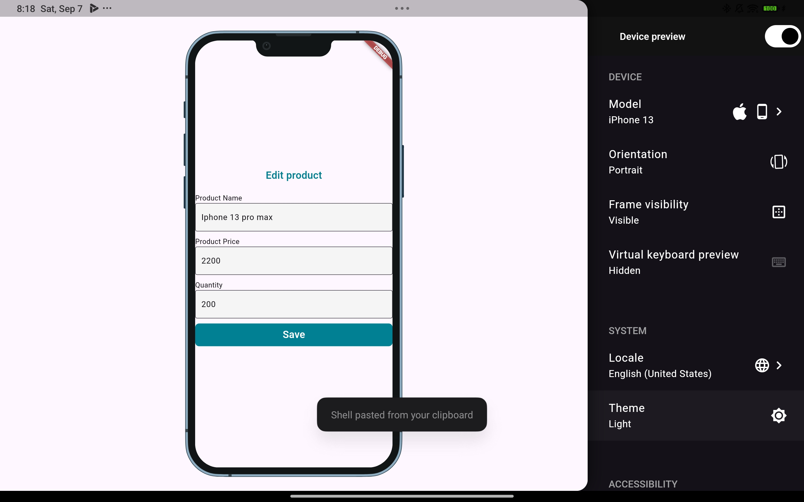
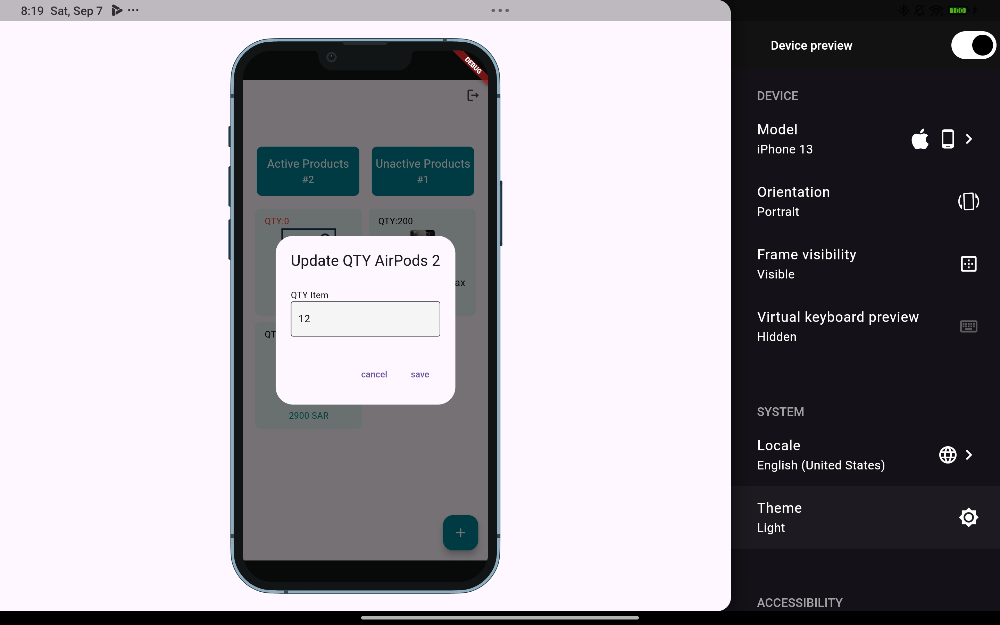

---

# Inventory Management Application

This is a **simplified inventory management** application built using **Flutter**. It allows users to manage products by adding, editing, and viewing available and unavailable products.

## Features

- **Home Page**: Displays the number of available and unavailable products (quantity = 0).
- **Add Product**: Add a new product with an image, name, price, and available quantity.
- **Edit Product**: Modify product details such as name, price, and quantity. Long press on a product to adjust the quantity.
- **User Authentication**: Includes registration and login pages.
- **Cross-Platform**: Works on both iOS and Android.

## Folder Structure

```bash
lib/
  ├── bloc/               # Logic Components
  ├── global/             # Global variables (GETIT)
  ├── helper/             # Helper utilities and functions
  ├── model/              # Data models
  ├── screen/             # Application screens
  ├── services/           # GETIT & shared preferences.
  ├── widget/             # Reusable widgets
  └── main.dart           # Entry point of the application
```

## Packages Used

The following Dart/Flutter packages are used in this project:

- `flutter_bloc: ^8.1.6`
- `get_it: ^7.7.0`
- `shared_preferences: ^2.3.2`
- `device_preview: ^1.2.0`
- `image_picker: ^1.1.2`

## Installation

1. **Clone the repository**:

```bash
git clone https://github.com/trt14/Project-6.git //go to my_branch
cd my_products_app
```

2. **Install dependencies**:

```bash
flutter pub get
```

3. **Run the application**:

```bash
flutter run
```

## How to Use

- **Add Products**: Use the add product screen to input product information, including an image, name, price, and quantity.
- **Edit Products**: Navigate to the product list and long-press on any product to edit its quantity.
- **User Authentication**: Register and login screens ensure only authorized users can access the app.

## Screenshots

### Login screen


### Add new account screen


### see all products


### edit product


### edit quantity of product



## The wonderful team

- Mahdi Alhelal
- Fahad 

---

Feel free to update the placeholders like `trt14` or add more details specific to your project!